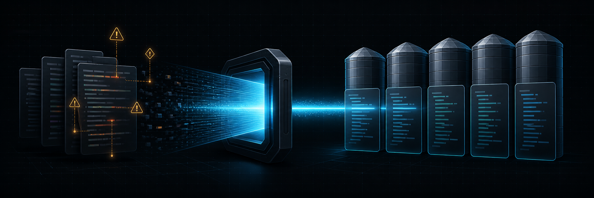

<h1 align="center">siloscan</h1>

<p align="center">
  <strong>Scan repositories for secrets, risky patterns, architecture drift, coverage gaps, and duplicated code.</strong><br>
  Fast, deterministic, and fully offline.
</p>

<p align="center">
  <a href="https://github.com/RandomCodeSpace/siloscan/actions/workflows/ci.yml"></a>
  <a href="https://crates.io/crates/siloscan"></a>
  <a href="LICENSE"></a>
  <a href="https://www.rust-lang.org"></a>
</p>

<p align="center">
  
</p>

Point siloscan at a repository and get a clear, ordered list of findings. It
ships with secret detection out of the box, accepts project-specific YAML
rules, and produces human-readable, JSON, or SARIF reports.

Everything runs on your machine. There is no account, server, daemon,
telemetry, or network call.

## Start scanning

Install the command-line scanner:

```sh
cargo install siloscan
```

Then run it in a repository, with no arguments:

```sh
siloscan
```

```text
setup: 1 project unit; languages: rust; rules: default-secrets@1, maintainability-rust@1, reliability-rust@1
capabilities: cache enabled; coverage not configured; embedded-rules enabled; profiles enabled; project-detection enabled; repository-config not configured; rule-directories not configured; scan-baseline not configured; symlink-following not configured
metrics: 8 lines, 3 code lines, 0 duplicated lines, 0.0% duplication
Report: /home/you/.local/state/siloscan/reports/<scope-key>/latest.json
Review: siloscan review
```

That run detected the project, scanned it with the embedded secret rules and
the profiles for the language it detected, and saved the report it printed.
Open that report in the terminal UI, without scanning again:

```sh
siloscan review
```

The scan itself is unchanged. Name a path, or give any scan option, and the
run behaves exactly as it did in 1.x:

```sh
siloscan .
siloscan . --rules ./rules
```

Prefer a prebuilt binary? Download one from
[GitHub Releases](https://github.com/RandomCodeSpace/siloscan/releases).
Archives are published for Linux x86-64, macOS arm64, and Windows x86-64.

> [!NOTE]
> Installing `siloscan` also installs the short alias `ss`, which accepts every
> command and flag `siloscan` does, `ss review` included. On Linux, `ss` can
> shadow the iproute2 socket-statistics command when Cargo's bin directory
> comes first in `PATH`.

## What a bare run does

`siloscan` with no path and no scan option:

- detects the project from repository files alone, without running Cargo, npm,
  Go, Maven, or any other project tool, and without touching the network;
- scans the current directory with the embedded secret pack and with the
  embedded profiles for the languages it detected;
- prints the resolved setup, then the usual findings and metrics;
- saves one report for that scan scope and names the command that opens it.

Each scan scope keeps exactly one report, replaced atomically, under this
user's platform state directory. `<scope-key>` is a hash of the canonical path
that was scanned, so two checkouts of the same project keep separate reports.

| Platform | Saved report |
| --- | --- |
| Linux | `$XDG_STATE_HOME/siloscan/reports/<scope-key>/latest.json`, or `~/.local/state/siloscan/...` when `XDG_STATE_HOME` is unset |
| macOS | `~/Library/Application Support/siloscan/reports/<scope-key>/latest.json` |
| Windows | `%LOCALAPPDATA%\siloscan\reports\<scope-key>\latest.json` |

Nothing is written into the scanned repository, and no report history is kept.

Every other invocation stays stateless, as in 1.x. Naming a path, including
`siloscan .`, or supplying any scan option means the run writes no report
unless you ask for one:

| Flag | Effect |
| --- | --- |
| `--save` | Save this scan to its scope's report slot, including on an explicit scan |
| `--no-save` | Save nothing, including the report a bare run would have saved |
| `--output FILE` | Write this scan's report to `FILE` and leave the saved slot as it was |

The three conflict with one another, so a scan writes at most one report. The
saved document is always canonical siloscan JSON, whatever `--format` prints,
and a failed save exits `2` rather than claiming success.

JSON reports now carry `report_kind`, `scope`, `outcome`, and `setup` fields,
appended after the fields 1.x wrote. Nothing 1.x wrote has changed.

### The profiles a bare run loads

A profile is one rule document shipped inside the binary, for one family and
one language. There are two families:

- **Reliability** reports code that is likely to be a bug: a comparison whose
  result is fixed, two branches of an `if` with the same body, a `return`
  inside a `finally`, a `defer` in a loop. A reliability rule is `warning` by
  default, and one whose measured noise sits between the warning ceiling and
  the info ceiling ships as `info` instead of being dropped.
- **Maintainability** reports code that is hard to work on rather than wrong:
  a debugging aid left in, a function that is too long, too nested, takes too
  many parameters, or has too many decision points. Every maintainability rule
  is `info`.

Eleven reliability rules are `info` on that measurement:
`reliability.c.assignment-in-condition`,
`reliability.csharp.case-insensitive-tolower-comparison`,
`reliability.csharp.gc-collect`, `reliability.csharp.rethrow-only-catch`,
`reliability.go.errors-new-sprintf`,
`reliability.go.redundant-boolean-comparison`,
`reliability.python.open-without-encoding`,
`reliability.ruby.rescue-exception`, `reliability.ruby.rescue-modifier`,
`reliability.rust.unimplemented-marker`, and
`reliability.rust.unnecessary-unwrap`.

Nothing in either family is `error`, so no profile finding changes an exit
status at the default threshold. There are 211 rules in 20 documents, covering
Rust, Python, JavaScript, TypeScript, Go, Java, C, C++, C#, and Ruby.

A bare run loads the documents for the languages detection reported and no
others, so a Go-only repository never sees a Ruby rule id. The `rules:` line
names each one by identity, `reliability-go@1` and `maintainability-go@1`, and
findings carry rule ids in the same shape: `reliability.go.<rule>`. A document
revised since it shipped carries a higher number: `reliability-python@2`,
`maintainability-python@2`, and `reliability-csharp@2` are at `@2`, and the
other seventeen are at `@1`. A named identity that no longer resolves, such as
`reliability-python@1`, exits `2` and lists what is available.

Four of the maintainability rules are measurements rather than patterns. Each
one measures a function and reports the function's name when it is over the
limit:

| Measure | Limit |
| --- | --- |
| Function length, in lines | 150 for C, Go, and JavaScript; 120 for Rust, Python, Java, and C# |
| Parameter count | 7; Python ships no parameter-count rule |
| Nesting depth | 5 |
| Cyclomatic complexity | 30 for C, 25 elsewhere |

The limits are measured, not chosen: each was set on a pinned corpus of real
repositories so that the rule reports rarely enough to stay readable. C++,
Ruby, and TypeScript ship no function-length rule for the same reason, and
Python ships no parameter-count rule: on boto it reported 2.8812 findings per
kLOC against a ceiling of 1.0, which is what a keyword-argument-per-API-field
SDK looks like rather than a defect, and no path class carried the breach. The
JavaScript function-length rule excludes test trees by path, because a test
suite body is a function to the grammar and not to a reader.

Turn them off per run, or leave them off:

| Flag | Effect |
| --- | --- |
| `--profiles none` | Load no profile; everything else about the scan is unchanged |
| `--profiles auto` | Load the profiles for the detected languages, on any run |
| `--profiles reliability-rust@1,...` | Load exactly these, whatever was detected |
| `--no-default-rules` | Load no embedded document at all, secret pack included |

Naming a path, or supplying any scan option, does not load profiles unless you
ask: `siloscan .` and every 1.x command line report exactly what they reported
before. Supplying `--profiles` is itself a scan option, so `siloscan
--profiles auto` is an explicit run that also loads them.

Profiles parse the source files they apply to, which a secret scan does not.
On a cold cache that is the dominant cost of a bare run; a warm cache skips it
along with the rest of the file.

## What it finds

| Check | Useful for |
| --- | --- |
| Secrets | Tokens, private keys, connection strings, and other credentials |
| Text patterns | TODOs, banned APIs, unsafe settings, and team conventions |
| Syntax-aware patterns | Matching code structure without fragile text searches |
| Boundaries | Preventing one repository area from importing a forbidden area |
| Coverage | Enforcing line-coverage targets from lcov or Cobertura reports |
| Duplication | Keeping repeated code below a project-defined budget |

Siloscan understands Rust, Python, JavaScript, TypeScript, Go, Java, C, C++,
C#, and Ruby for syntax-aware rules. Text and secret rules work with any UTF-8
text file.

## Add a rule

Rules are ordinary YAML files. This one reports TODO markers while ignoring
fixture files:

```yaml
version: 1
rules:
  - id: cleanup.todo-marker
    severity: warning
    message: "TODO left in source"
    paths:
      exclude: ["**/fixtures/**"]
    regex:
      pattern: '\bTODO\b'
      group: 0
      redact: false
```

Save it under `rules/`, then run:

```sh
siloscan . --rules ./rules
```

To check a rule against fixtures before using it in CI:

```sh
siloscan test ./rules/fixtures --rules ./rules --no-default-rules
```

Place `siloscan-expect: cleanup.todo-marker` on the line before an expected
fixture match. The test fails for both missing and unexpected findings.

## Keep existing debt under control

You do not have to fix an old repository in one heroic weekend. Record current
findings as the baseline:

```sh
siloscan baseline .
```

The baseline is written to `.siloscan/baseline.json`. Commit it when the
accepted debt should be shared by the team. Future scans still show that debt,
but only new findings fail the scan.

For a reviewed exception next to the code, suppress one rule on the current or
following line:

```text
let value = fixture(); // siloscan-ignore-line: cleanup.todo-marker

// siloscan-ignore: cleanup.todo-marker
TODO
```

Suppressed findings remain visible in JSON and the terminal UI instead of
quietly disappearing.

## Review findings in the terminal

`siloscan review` opens the interactive UI. It ships with the scanner, so
`cargo install siloscan` is the only install needed:

```sh
siloscan review                   # the saved report for the current directory
siloscan review PATH              # the saved report for that scan scope
siloscan review --report FILE     # one report file, wherever it came from
siloscan review --live            # scan now and triage the result
```

`ss review` is the same command. `--live` also takes a `PATH`. A saved review
never rescans; a live one resolves a fresh scan, including for every rescan
started inside the UI.

Use the UI to:

- see repository-wide counts and severity at a glance;
- filter findings and inspect nearby code;
- review baseline and inline-suppression decisions;
- explore duplication groups and dependencies between silos.

The UI is also published on its own, for people who triage reports produced
elsewhere:

```sh
cargo install siloscan-tui
siloscan-tui .
siloscan-tui --report siloscan.json
```

Snapshot mode is read-only. Live-mode actions that change a baseline or source
file require an explicit verdict.

## Use it in CI

Write JSON for automation or SARIF for code-scanning tools:

```sh
siloscan . --format json > siloscan.json
siloscan . --format sarif > siloscan.sarif
```

Both name a path, so neither saves a report. A bare `siloscan` in a script does
save one; add `--no-save` to keep it stateless.

Control what fails and what gets printed independently:

```sh
siloscan . --fail-on warning --min-severity error
```

| Exit status | Meaning |
| --- | --- |
| `0` | No new finding reached the failure threshold |
| `1` | At least one new finding reached the threshold |
| `2` | The command, configuration, rules, or required input was invalid |

Reports use stable finding fingerprints and deterministic ordering, so results
remain useful in diffs and automation.

## Set repository defaults

Add `siloscan.toml` at the repository root when the team should share rule
paths, source roots, or architecture silos:

```toml
rules = ["rules"]
source_roots = ["src"]

[silos]
core = ["src/core/**"]
api = ["src/api/**"]
storage = ["src/storage/**"]
```

Command-line options can still override the scan for one run. Use
`siloscan --help` and `siloscan-tui --help` for the complete option list.

## Safe defaults

- Hidden files such as `.env` are scanned.
- Repository `.gitignore` and `.ignore` files are honored.
- Symlinks are not followed outside the scan root.
- Secret matches are redacted from serialized reports and the UI.
- The cache never stores matched secret text.
- Skipped, ignored, binary, and unreadable paths are accounted for in reports.

## Build and test

The workspace contains the scanner library, CLI, and terminal UI.

```sh
cargo build --locked --workspace
cargo fmt --all -- --check
cargo clippy --locked --workspace --all-targets -- -D warnings
cargo test --locked --workspace
```

## Limits

- Generic secret rules favor fewer false positives. Add rules for private
  credential formats and deployment conventions.
- Boundary checks resolve imports inside the scanned file set; they are not a
  replacement for a compiler or build system.
- Binary and non-UTF-8 files are reported as skipped rather than treated as
  clean.
- Large files still receive text checks but may skip syntax-aware parsing,
  depending on the configured parse limit.

## License

Siloscan is available under the [MIT License](LICENSE). The embedded secret
pack is derived from [gitleaks](https://github.com/gitleaks/gitleaks), also
under MIT; see [NOTICE](NOTICE) for attribution.
