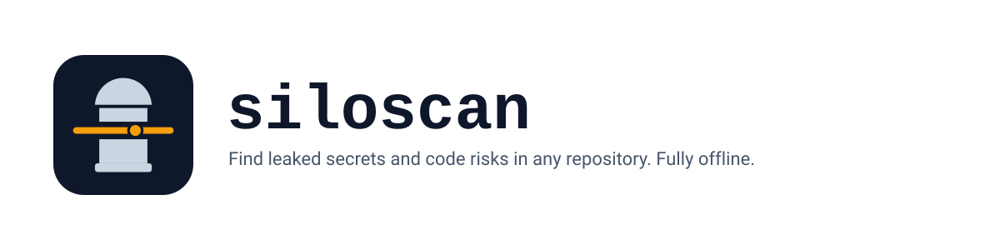

<p align="center">
  
</p>

<h1 align="center">siloscan</h1>

<p align="center">
  <strong>An offline secret scanner for your repositories.</strong>
</p>

<p align="center">
  <picture>
    <source media="(prefers-color-scheme: dark)" srcset="assets/banner-dark.svg">
    
  </picture>
</p>

<p align="center">
  <a href="https://github.com/RandomCodeSpace/siloscan/actions/workflows/ci.yml"></a>
  <a href="https://crates.io/crates/siloscan"></a>
  <a href="LICENSE"></a>
  <a href="https://www.rust-lang.org"></a>
</p>

## What it does

siloscan is a secret scanner that finds leaked credentials in a repository:
API keys, tokens, passwords, private keys, and cloud credentials. Secrets
detection uses 228 rules: 221 of the 222 gitleaks v8.30.1 rules, plus seven of
siloscan's own. Optional per-language checks report maintainability and
reliability problems in ten languages. It runs on your machine and works
air-gapped: no account, no server, no telemetry, no network. Reports print as
text, JSON, or SARIF, so CI and code scanning tools read them directly.

## Install

siloscan is a single Rust binary. Install it from crates.io:

```sh
cargo install siloscan
```

Prebuilt archives for Linux, macOS, and Windows are on the
[Releases page](https://github.com/RandomCodeSpace/siloscan/releases). Each
archive contains three binaries: `siloscan`, the short alias `ss`, and
`siloscan-tui`.

## Scan in one command

Point it at a directory:

```sh
siloscan .
```

Every finding is one line: path, line, column, severity, rule id, and what the
rule found.

```text
config.ini:1:21 error secrets.aws-access-token Identified a pattern that may indicate AWS credentials, risking unauthorized cloud resource access and data breaches on AWS platforms.
metrics: 1 line, 0 duplicated lines, 0.0% duplication
```

By default the scanner does not print the secret it matched. In a saved report
the match reads:

```json
"matched": "<redacted>"
```

To read findings interactively, open the terminal UI:

```sh
siloscan-tui .
```

For other tools, write JSON or SARIF instead of text:

```sh
siloscan . --format json > siloscan.json
siloscan . --format sarif > siloscan.sarif
```

## Why siloscan

- Works offline and in air-gapped networks. Nothing leaves the machine.
- Deterministic output: stable ordering and stable finding fingerprints.
- Fast on large trees, with a cache that skips unchanged files.
- Secret matches are redacted by default, in reports and in the UI.
- SARIF output uploads straight to GitHub code scanning.
- A baseline keeps existing debt from blocking new work.
- You can write your own rules in YAML, no plugin API needed.

## For teams

In CI, siloscan exits `0` when no new finding reached the failure threshold and
`1` when one did. It exits `2` when the command, config, or rules were invalid,
so a broken setup never reads as a pass. `--fail-on` sets the threshold, and
`--min-severity` narrows what gets printed without moving the exit code. See
[CI usage](REFERENCE.md#use-it-in-ci).

A baseline records today's findings as accepted. Run `siloscan baseline .` and
commit the `.siloscan/baseline.json` it writes. Later scans still show the old
findings, but fail only on new ones. That is the ratchet: the accepted set only
shrinks. Every finding you fix and drop from the baseline becomes a line the
team cannot cross again. See
[baselines](REFERENCE.md#keep-existing-debt-under-control).

## Languages

Per-language maintainability and reliability profiles ship inside the binary
for ten languages:

rust, python, javascript, typescript, go, java, csharp, c, cpp, ruby.

Secret and text rules work on any UTF-8 file, whatever the language.

## Documentation

- [Reference](REFERENCE.md): every command, flag, rule field, and default.
- [Changelog](CHANGELOG.md): what changed in each release.
- [Detection corpus](crates/siloscan-core/tests/corpus/README.md): how
  detection is measured.

## License

MIT. See [LICENSE](LICENSE).
